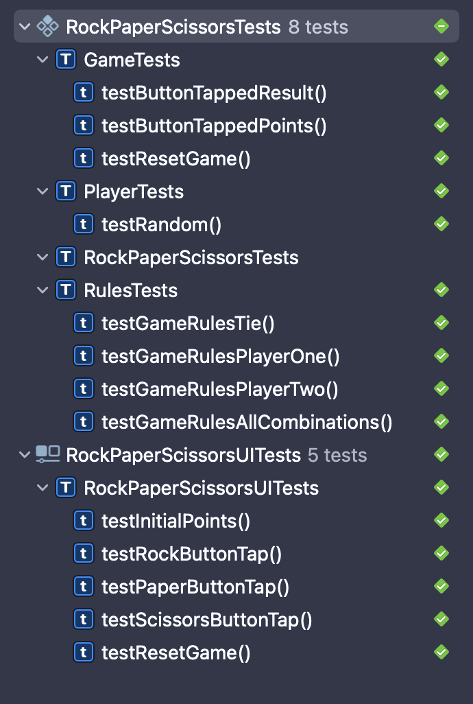

# Tests

- **Unit tests**:
  They are focused to the most atomic level of code (generally functions).
  Unit tests are used to verify individual functionality.
- **Integration tests**:
  Used to combine different modules or units of code.
  They are a way to test if different units are working correctly together.
- **System tests**:
  Tests that encompass the whole system, from UI to business logic.
- **Regression tests**:
  These type of tests are all the unit tests that have been combined throughout the time.
  When a change is added to the code, these tests are useful to verify if all other
  modules work correctly, of if they have been affected.
- **Automated tests**:
  All of the examples above can be performed manually, or they can be automated.
  If the frameworks allows it, the developer can write tests that verify the program's behavior
  with predefined inputs and expected outputs.
- **Edge case tests**:
  They are a testing technique that focuses on using the most extreme inputs,
  including unexpected ones, to ensure that the program behaves correctly in these situations.

### Tools (Herramientas)

| Nombre          | Tipo        | Licencia    | Plataforma                                               | Particularidades                                                                                                                                                                                        |
| --------------- | ----------- | ----------- | -------------------------------------------------------- | ------------------------------------------------------------------------------------------------------------------------------------------------------------------------------------------------------- |
| VectorCAST      | Integración | Comercial   | C o C++                                                  | Valida los sistemas integrados críticos para la seguridad y el negocio Se usa ampliamente en industrias financieras, dispositivos médicos, controles industriales, ferrocarriles.                       |
| Citrus          | Integración | Open Source | Java                                                     | Establece secuencia de mensajes y crea mensajes de error Enviar y recibir mensajes Espere el mensaje y active otro mensaje                                                                              |
| LDRA            | Integración | Open Source | C C++ Java Ada95                                         | Las pruebas se pueden generar y ejecutar fácilmente Variedad de soporte para que las pruebas tengan un entorno común para una amplia gama de proyectos                                                  |
| Jasmine         | Integración | Open Source | Javascript                                               | Para hacer las pruebas tiene una sintaxis simple No necesita ningún framework extra de javascript                                                                                                       |
| eZscript        | Integración | Comercial   | Delphi / Kylix                                           | Es compatible con las plataformas Windows y Linux. Incluye funciones personalizadas que no existen en VB, como las funciones de administración de archivos FileRead y FileRename.                       |
| Xcode Cloud     | Integración | Comercial   | Swift y Objective C                                      | Permite tener un flujo de trabajo para integración contínua Se encarga de ejecutar las pruebas con cada commit Prueba el código antes de ser publicado al App Store                                     |
| Embunit         | Unitarias   | Comercial   | C y C++                                                  | Crea el código para las pruebas automáticamente                                                                                                                                                         |
| MochaJS         | Unitarias   | Open Source | JavaScript                                               | Implementado en nodejs Soporte para diferentes navegadores Proporciona una base limpia para desarrollar pruebas Utilizar cualquier librería                                                             |
| JUnit           | Unitarias   | Open Source | Java                                                     | Permite escribir casos de prueba mientras se desarrolla el software, esto puede ayudar a realizar pruebas tempranas y detectar problemas. Soportado por todos los entornos de desarrollo integrados     |
| SimpleTest      | Unitarias   | Open Source | Php                                                      | Permite crear los casos de prueba en scripts ejecutables                                                                                                                                                |
| Módulo Unittest | Unitarias   | Open Source | Python                                                   | Permite hacer pruebas unitarias, pruebas integradoras, pruebas de un extremo a otro, pruebas de estrés y muchas otras por medio de la conexión de python a cliente.                                     |
| SpiraTest       | Sistema     | Comercial   | Ruby                                                     | Maneja tareas y encuentra bugs de manera efectiva Agrega problemas y tareas al usuario designado en cierta área                                                                                         |
| Rapise          | Sistema     | Comercial   | Java, .NET, Flash, Qt, SWT, Ajax, WPF, Silverlight, etc. | Admite la ejecución en paralelo. Cuenta con automatización asistida. Los test que realiza están basados en los requisitos y en modelos, son parametrizados y evalúan la seguridad. Conformidad Unicode. |
| Leapwork        | Sistema     | Comercial   | Cloud, SaaS, Web, Windows                                | Admite la ejecución en paralelo Gestión de requisitos Tests basados en los requisitos Tests de seguridad Verificación de script de tests                                                                |
| LambdaTest      | Sistema     | Comercial   | JIRA, Asana, Github, Trello, Slack                       | Pruebas interactivas en vivo a través de VM alojado en la nube LambdaTest Prueba automática de navegador  Integración con varias herramientas de CI / CD                                                |
| SauceLabs       | Sistema     | Comercial   | Cloud, Web, IOS, Android,                                | Admite la ejecución en paralelo  Detecta regresiones visuales en tu aplicación UI Te permite hacer tests automatizados basados en requisitos                                                            |
| Katalon Studio  | Sistema     | Comercial   | Eclipse                                                  | Permite automatizar aplicaciones web, aplicaciones móviles y pruebas API. Grabación y reproducción para aplicaciones web y móviles. Permite ejecutar pruebas en una configuración diferente.            |

## Test cases

### User stories

- As a user, when I tap the rock button, I expect the computer to select a move, and view a result
- As a user, when I choose rock and the computer chooses scissors, I expect to win a point (etc.)
- As a user, when I tap the reset button, I expect to see all points reset to 0

### Unit tests

#### Game button tapped

**ID:** G00

**Scenario:** When a button is tapped with a move, a winner should be given by the game (random)

**Input:** move = `GameMove.rock`

**Expected output:** One of `.one`, `.two` or `.tie` (`Rules.WinnerIndex`)

---

#### Game button points

**ID:** G01

**Scenario:** When a button is tapped, the game points should be updated accordingly

**Input:** move = `GameMove.rock`

**Expected output:**

- If player wins: `game.playerPoints == 1` and `game.cpuPoints == 0`
- If player loses: `game.playerPoints == 0` and `game.cpuPoints == 1`
- If it is a tie: `game.playerPoints == 0` and `game.cpuPoints == 0`

---

#### Reset game

**ID:** G02

**Scenario:** When a user resets the game, all points should be 0

**Input:** Game with points

**Expected output:** `game.playerPoints == 0` and `game.cpuPoints == 0`

---

#### Tie

**ID:** R00

**Scenario:** When both players choose the same move, it should be a tie

**Input:** `move1 = GameMove.rock` and `move2 = GameMove.rock`

**Expected output:** `Rules.WinnerIndex.tie`

---

#### Player 1 winner

**ID:** R01

**Scenario:** When a player choses a move that wins to the cpu, player should be the winner

**Input:** `move1 = GameMove.paper` and `move2 = GameMove.rock`

**Expected output:** `Rules.WinnerIndex.one`

---

#### Player 2 winner

**ID:** R02

**Scenario:** When a player choses a move that loses to the cpu, cpu should be the winner

**Input:** `move1 = GameMove.rock` and `move2 = GameMove.paper`

**Expected output:** `Rules.WinnerIndex.two`

---

#### All combinations

**ID:** R03

**Scenario:** Tests all the posible combinations of moves and their expected outputs

**Input:** (See test file for an accurate description)

**Expected output:** (See test file for an accurate description)

---

#### Random move

**ID:** P00

**Scenario:** Generate a random move

**Input:** None

**Expected output:** One of `.rock`, `.paper`, or `.scissors` (`GameMove`)

---

### UI tests

#### Initial game state

**ID:** S00

**Scenario:** A user opens the app and no buttons are pressed

**Instructions:** Open the app

**Input:** None

**Expected output:**

- `playerPointsLabel` text is `"0"`
- `cpuPointsLabel` text is `"0"`
- `resultLabel` text is `"Tap to play the game"`

---

#### Rock button tap

**ID:** S01

**Scenario:** The rock button is tapped by the user

**Instructions:** Tap the rock button 10 times

**Input:** None

**Expected output:**

- `playerPointsLabel` text is NOT `"0"`
- `cpuPointsLabel` text is NOT `"0"`

---

#### Paper button tap

**ID:** S02

**Scenario:** The paper button is tapped by the user

**Instructions:** Tap the paper button 10 times

**Input:** None

**Expected output:**

- `playerPointsLabel` text is NOT `"0"`
- `cpuPointsLabel` text is NOT `"0"`

---

#### Scissors button tap

**ID:** S03

**Scenario:** The scissors button is tapped by the user

**Instructions:** Tap the rock button 10 times

**Input:** None

**Expected output:**

- `playerPointsLabel` text is NOT `"0"`
- `cpuPointsLabel` text is NOT `"0"`

---

#### Reset button tap

**ID:** S04

**Scenario:** The user resets a game

**Instructions:**

- Tap the rock button 10 times
- Tap the reset game button

**Input:** None

**Expected output:**

- `playerPointsLabel` text is `"0"`
- `cpuPointsLabel` text is `"0"`
- `resultLabel` text is `"Tap to play the game"`

---

### Test Results

| ID    | Result |
| ----- | :----: |
| `G00` |   ✅   |
| `G01` |   ✅   |
| `G02` |   ✅   |
| `R00` |   ✅   |
| `R01` |   ✅   |
| `R02` |   ✅   |
| `R03` |   ✅   |
| `P00` |   ✅   |
| `S00` |   ✅   |
| `S01` |   ✅   |
| `S02` |   ✅   |
| `S03` |   ✅   |
| `S04` |   ✅   |

## References:

- Abhishek Kothari. (2021). 11 mejores herramientas y marco de pruebas unitarias. 25/8/2022, de GEEKFLARE Sitio web: https://geekflare.com/es/javascript-unit-testing/
- Capterra. (2022, junio). Rapise. https://www.capterra.mx/software/132835/rapise#features
- EZscript - a cross-platform interpreter. (2013, March 8). SourceForge. Retrieved August 24, 2022, from https://sourceforge.net/projects/ezscript/
- JUnit - Overview. (s. f.). Recuperado de https://www.tutorialspoint.com/junit/junit_overview.htm#
- My Server Name. (2012).  Las 10 mejores herramientas de prueba de integración para escribir pruebas de integración. https://spa.myservername.com/top-10-integration-testing-tools-write-integration-tests
- Leapwork. Capterra. (n.d.). Retrieved August 25, 2022, from https://www.capterra.mx/software/162251/leaptest#features
- Shaik, H. K. (2021, November 8). Prueba unitaria con el Módulo unittest de python. Geekflare. Retrieved August 25, 2022, from https://geekflare.com/es/unit-testing-with-python-unittest/#
- NA. (NA). 50 Best Integration Testing Tools. 24/08/2022, de threat stack Sitio web: https://www.threatstack.com/blog/50-best-integration-testing-tools
- Software Testing Help. (2022, 7 agosto). 20 Most Popular Unit Testing Tools In 2022. Recuperado 24 de agosto de 2022, de https://www.softwaretestinghelp.com/unit-testing-tools/
- SauceLabs. Sauce Labs. (n.d.). Retrieved August 25, 2022, from https://saucelabs.com/platform
- ‌Test Management Software - 30 Day Trial. (2022). Inflectra.com. https://www.inflectra.com/Landing/Test-Management.aspx?source=CapterraAd&listing=SpiraTest&utm_source=GetApp
- Xcode Cloud. Recuperado el 23 de agosto del 2022, de https://developer.apple.com/xcode-cloud/
