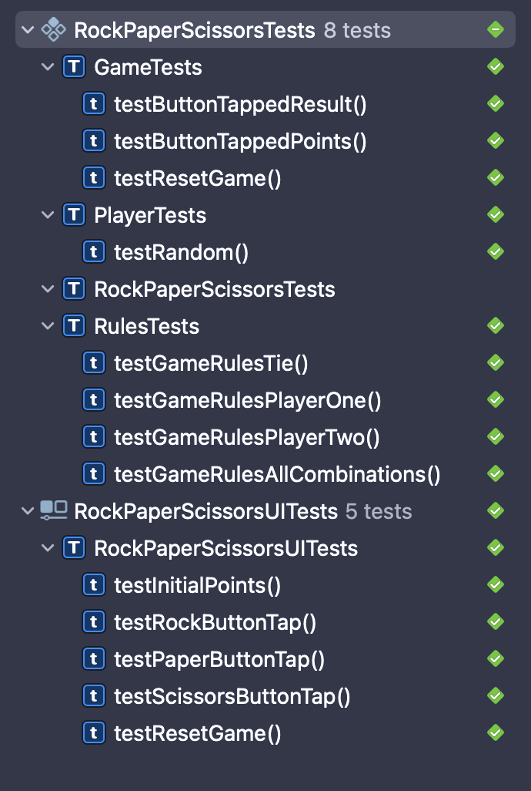

# Tests

... (Research) ...

## Test cases

## User stories

...

### Unit tests

#### Game button tapped

**ID:** G00

**Scenario:** When a button is tapped with a move, a winner should be given by the game (random)

**Input:** move = `GameMove.rock`

**Expected output:** One of `.one`, `.two` or `.tie` (`Rules.WinnerIndex`)

---

#### Game button points

**ID:** G01

**Scenario:** When a button is tapped, the game points should be updated accordingly

**Input:** move = `GameMove.rock`

**Expected output:**

- If player wins: `game.playerPoints == 1` and `game.cpuPoints == 0`
- If player loses: `game.playerPoints == 0` and `game.cpuPoints == 1`
- If it is a tie: `game.playerPoints == 0` and `game.cpuPoints == 0`

---

#### Reset game

**ID:** G02

**Scenario:** When a user resets the game, all points should be 0

**Input:** Game with points

**Expected output:** `game.playerPoints == 0` and `game.cpuPoints == 0`

---

#### Tie

**ID:** P00

**Scenario:** When both players choose the same move, it should be a tie

**Input:** `move1 = GameMove.rock` and `move2 = GameMove.rock`

**Expected output:** `Rules.WinnerIndex.tie`

---

#### Player 1 winner

**ID:** R01

**Scenario:** When a player choses a move that wins to the cpu, player should be the winner

**Input:** `move1 = GameMove.paper` and `move2 = GameMove.rock`

**Expected output:** `Rules.WinnerIndex.one`

---

#### Player 2 winner

**ID:** R02

**Scenario:** When a player choses a move that loses to the cpu, cpu should be the winner

**Input:** `move1 = GameMove.rock` and `move2 = GameMove.paper`

**Expected output:** `Rules.WinnerIndex.two`

---

#### All combinations

**ID:** R03

**Scenario:** Tests all the posible combinations of moves and their expected outputs

**Input:** (See test file for an accurate description)

**Expected output:** (See test file for an accurate description)

---

#### Random move

**ID:** P00

**Scenario:** Generate a random move

**Input:** None

**Expected output:** One of `.rock`, `.paper`, or `.scissors` (`GameMove`)

---

### UI tests

#### Initial

**ID:** S00

**Scenario:** A user opens the app and no buttons are pressed

**Instructions** Open the app

**Input:** None

**Expected output:**

- `playerPointsLabel` text is `"0"`
- `cpuPointsLabel` text is `"0"`
- `resultLabel` text is `"Tap to play the game"`

---

#### Rock button tap

**ID:** S01

**Scenario:** The rock button is tapped by the user

**Instructions** Tap the rock button 10 times

**Input:** None

**Expected output:**

- `playerPointsLabel` text is NOT `"0"`
- `cpuPointsLabel` text is NOT `"0"`

---

#### Paper button tap

**ID:** S02

**Scenario:** The paper button is tapped by the user

**Instructions** Tap the paper button 10 times

**Input:** None

**Expected output:**

- `playerPointsLabel` text is NOT `"0"`
- `cpuPointsLabel` text is NOT `"0"`

---

#### Scissors button tap

**ID:** S03

**Scenario:** The scissors button is tapped by the user

**Instructions** Tap the rock button 10 times

**Input:** None

**Expected output:**

- `playerPointsLabel` text is NOT `"0"`
- `cpuPointsLabel` text is NOT `"0"`

---

#### Reset button tap

**ID:** S04

**Scenario:** The user resets a game

**Instructions**

- Tap the rock button 10 times
- Tap the reset game button

**Input:** None

**Expected output:**

- `playerPointsLabel` text is `"0"`
- `cpuPointsLabel` text is `"0"`
- `resultLabel` text is `"Tap to play the game"`

---

### Results

| ID    | Result |
| ----- | :----: |
| `G00` |   ✅   |
| `G01` |   ✅   |
| `G02` |   ✅   |
| `P00` |   ✅   |
| `R01` |   ✅   |
| `R02` |   ✅   |
| `R03` |   ✅   |
| `P00` |   ✅   |
| `S00` |   ✅   |
| `S01` |   ✅   |
| `S02` |   ✅   |
| `S03` |   ✅   |
| `S04` |   ✅   |

